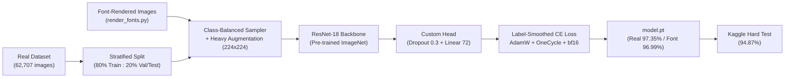
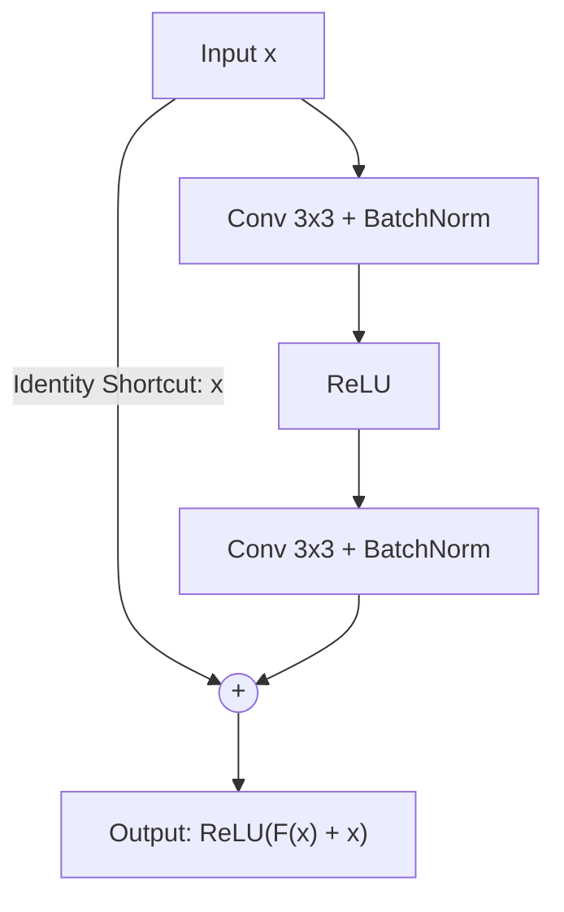
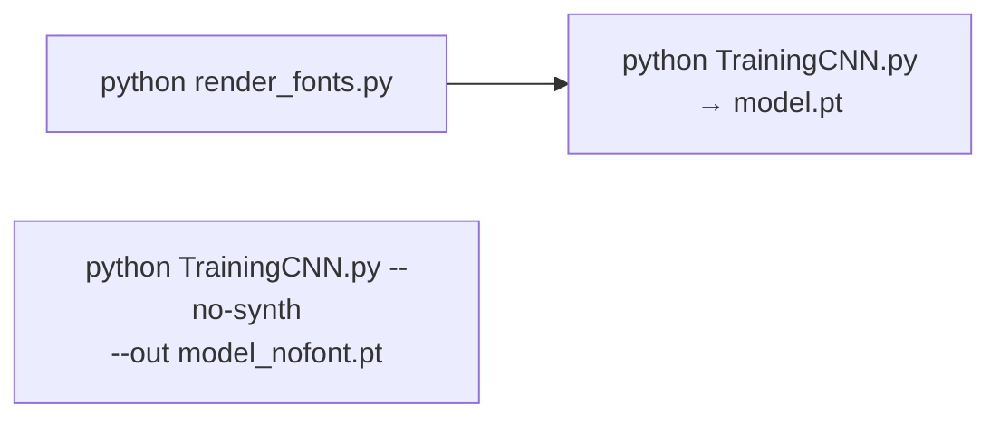

# เอกสารสรุปเนื้อหาประกอบการนำเสนอโครงงาน (Project Presentation & Report)

## การรู้จำและจำแนกอักขระภาษาไทย 72 คลาส ด้วย ResNet-18 + Data Augmentation + Font-Rendered Data

---

### สารบัญหัวข้อตามเกณฑ์การประเมิน

1. [การอธิบายชุดข้อมูล (Dataset Overview)](#1-การอธิบายชุดข้อมูล-dataset-overview)
2. [การวิเคราะห์ความท้าทายของชุดข้อมูล (Dataset Challenges)](#2-การวิเคราะห์ความท้าทายของชุดข้อมูล-dataset-challenges)
3. [การแบ่งชุดข้อมูล Train และ Validation (80:20 Stratified Split)](#3-การแบ่งชุดข้อมูล-train-และ-validation-8020-stratified-split)
4. [โครงสร้าง CNN ที่ใช้งานในภาพรวม (CNN Architecture Overview)](#4-โครงสร้าง-cnn-ที่ใช้งานในภาพรวม-cnn-architecture-overview)
5. [การทำงานของ CNN และจุดเด่นของสถาปัตยกรรม (Residual Connections)](#5-การทำงานของ-cnn-และจุดเด่นของสถาปัตยกรรม-residual-connections)
6. [เทคนิคการถ่ายโอนความรู้ (Transfer Learning)](#6-เทคนิคการถ่ายโอนความรู้-transfer-learning)
7. [เทคนิคการสังเคราะห์ข้อมูล (Data Augmentation)](#7-เทคนิคการสังเคราะห์ข้อมูล-data-augmentation)
8. [เทคนิคและแนวคิดที่น่าสนใจ (Advanced Techniques)](#8-เทคนิคและแนวคิดที่น่าสนใจ-advanced-techniques)
9. [ขั้นตอนและระเบียบวิธีฝึกสอนแบบจำลอง (Training Methodology)](#9-ขั้นตอนและระเบียบวิธีฝึกสอนแบบจำลอง-training-methodology)
10. [ประสิทธิภาพของชุดฝึกสอนและความแม่นยำ (Experimental Results & Accuracy)](#10-ประสิทธิภาพของชุดฝึกสอนและความแม่นยำ-experimental-results--accuracy)
11. [ผลทดสอบบน Kaggle Synthetic Hard Test Set](#11-ผลทดสอบบน-kaggle-synthetic-hard-test-set)
12. [สรุปผลการดำเนินงาน (Conclusion)](#12-สรุปผลการดำเนินงาน-conclusion)

---



---

### 1. การอธิบายชุดข้อมูล (Dataset Overview)

* **ที่เก็บข้อมูล:** `dataset/round2/<class>/` (ชื่อโฟลเดอร์คือรหัส TIS-620 เช่น `161` = ก, `162` = ข)
* **จำนวนคลาสทั้งหมด:** **72 คลาส** ได้แก่ พยัญชนะ, สระ, วรรณยุกต์/เครื่องหมาย และเลขไทย
* **จำนวนภาพทั้งหมด:** **62,707 ภาพ** (.jpg)
* **การกระจายตัวของข้อมูลในแต่ละคลาส:**
  * **คลาสที่มีตัวอย่างมากที่สุด:**
    1. `210` (สระอา **า**) : **5,025 ภาพ**
    2. `185` (**ร**) : **4,863 ภาพ**
    3. `195` (**น**) : **4,663 ภาพ**
  * **คลาสที่มีตัวอย่างน้อยที่สุด:**
    1. `163` (**ฃ**) : **1 ภาพ**
    2. `177` (**ฑ**) : **1 ภาพ**
    3. `204` (**ฤ**) : **3 ภาพ**
    4. `247` (**๗**) : **4 ภาพ**
    5. `206` (**ฮ**) : **10 ภาพ**
* **ลักษณะภาพ:** ภาพตัวอักษรเดี่ยวแบบตัดชิดขอบ (Cropped) ขนาดเล็กประมาณ **10x10 ถึง 35x35 พิกเซล** ลายเส้นดำบนพื้นขาว

#### ชุดข้อมูลทดสอบเพิ่มเติม
| ชุดข้อมูล | จำนวน | ลักษณะ |
|---|---|---|
| `archive/synthetic_test_set/` (Font test) | 432 ภาพ | 72 คลาส x 6 ฟอนต์ (Angsana, Cordia, Leelawadee, Tahoma ฯลฯ) |
| Kaggle `synthetic-test-set` (Hard test) | 2,556 ภาพ | 72 คลาส x 20 รูปแบบการบิดเบือน (หมุน, noise, blur, รอยขีด ฯลฯ) |

#### ตัวอย่างโค้ด: แปลงชื่อโฟลเดอร์เป็นตัวอักษรไทย
```python
def class_char(cls):
    """Folder names are TIS-620 byte codes, e.g. '161' -> 'ก'."""
    return bytes([int(cls)]).decode("cp874")
```

---

### 2. การวิเคราะห์ความท้าทายของชุดข้อมูล (Dataset Challenges)

1. **Class Imbalance รุนแรง (5,025 : 1):**
   * สระอามี 5,025 ภาพ แต่ ฃ และ ฑ มีเพียง **1 ภาพ** ทำให้โมเดลไม่เคยเห็นรูปแบบอื่นของคลาสหายาก
2. **ความละเอียดต่ำ (Low Resolution):**
   * ภาพต้นฉบับเล็กมาก (~10-35 px) เมื่อขยายเป็น 224x224 รายละเอียดเล็กๆ อย่างหัวอักษรหรือรอยหยักจะเบลอ
3. **อักขระที่คล้ายกันมาก (Similar Classes):**
   * ข/ฃ, ช/ซ, ฎ/ฏ, ภ/ถ, และคู่ที่แทบเหมือนกันทุกพิกเซลอย่าง **ๅ (ลากข้าง) / า (สระอา)**
   * วรรณยุกต์และสระบน/ล่าง (่ ้ ั ็ ู) มีขนาดเล็กและรูปทรงใกล้เคียงกัน
4. **ภาพบิดเบี้ยว (Distorted Characters):**
   * ภาพจริงมีทั้งเอียง หนา/บาง ขาดหาย และมีสัญญาณรบกวน
5. **ความหลากหลายของฟอนต์ (Font Generalization):**
   * ชุดข้อมูลจริงมีสไตล์จำกัด โมเดลแรก (baseline) ได้เพียง **78.47%** บน Font test

---

### 3. การแบ่งชุดข้อมูล Train และ Validation (80:20 Stratified Split)

* **สัดส่วน:** **80% Train (50,162 ภาพ)** และ **20% Val/Test (12,545 ภาพ)**
* **Stratified ต่อคลาส:** แบ่ง 80:20 แยกทีละคลาส เพื่อให้ทุกคลาสปรากฏในทั้งสองชุด
* **คลาสที่มีภาพเดียว (ฃ, ฑ):** เก็บไว้ใน Train ทั้งหมด (ไม่คัดลอกไป Val เพื่อไม่ให้ผลทดสอบรั่วไหล)
* **Seed คงที่ (`SEED = 42`):** ผลการทดลองทำซ้ำได้
* **สองโหมดการประเมิน:**
  * `model.pt`: ใช้ 20% เป็น **Validation** + ใช้ฟอนต์ที่กันไว้ 2 ตระกูล (Kodchiang, Lily) เป็น **Font validation** สำหรับเลือก epoch ที่ดีที่สุด
  * `model_nofont.pt` (`--no-synth`): ใช้ 20% เป็น **Test set บริสุทธิ์** ไม่ใช้เลือกโมเดลเลย ประเมินครั้งเดียวตอนจบ

#### ตัวอย่างโค้ดที่ใช้งาน (`TrainingCNN.py`):
```python
def stratified_split(samples, val_frac, seed):
    """Split per class so rare classes appear in both train and val (when they have >=2 images)."""
    by_class = defaultdict(list)
    for s in samples:
        by_class[s[1]].append(s)
    rng = random.Random(seed)
    train, val = [], []
    for label in sorted(by_class):
        items = by_class[label]
        rng.shuffle(items)
        n_val = min(int(round(len(items) * val_frac)), len(items) - 1)
        val += items[:n_val]
        train += items[n_val:]
    return train, val
```

---

### 4. โครงสร้าง CNN ที่ใช้งานในภาพรวม (CNN Architecture Overview)

ใช้ **ResNet-18** พร้อมปรับส่วนหัว (Classifier Head) ใหม่สำหรับ 72 คลาส

| เลเยอร์ / บล็อก | โครงสร้างภายใน | ขนาด Feature Map | หน้าที่ |
| :--- | :--- | :---: | :--- |
| **Input** | RGB Image | 224 x 224 x 3 | ภาพตัวอักษรนำเข้า |
| **Initial Conv** | Conv 7x7 (64 filters), Stride 2, BN, ReLU | 112 x 112 x 64 | ตรวจจับขอบพื้นฐาน |
| **Max Pooling** | MaxPool 3x3, Stride 2 | 56 x 56 x 64 | ลดขนาดเชิงพื้นที่ |
| **Stage 1** | 2 Residual Blocks (3x3 Conv) | 56 x 56 x 64 | เส้นโค้ง มุม |
| **Stage 2** | 2 Residual Blocks, conv แรก Stride 2 | 28 x 28 x 128 | ส่วนประกอบย่อย (หัว, หยัก) |
| **Stage 3** | 2 Residual Blocks, conv แรก Stride 2 | 14 x 14 x 256 | รูปร่างอักษรระดับกลาง |
| **Stage 4** | 2 Residual Blocks, conv แรก Stride 2 | 7 x 7 x 512 | คุณลักษณะขั้นสูง |
| **Global Avg Pooling** | 7x7 → 1x1 | 1 x 1 x 512 | เวกเตอร์ฟีเจอร์ 512 มิติ |
| **Classifier Head (ใหม่)** | **Dropout(0.3) + Linear(512, 72)** | 72 Logits | ทำนาย 72 คลาส (แทน FC 1000 คลาสเดิม) |

* **จำนวนพารามิเตอร์ทั้งหมด:** ~11.2 ล้าน (11,213,448)

#### ตัวอย่างโค้ดที่ใช้งาน (`TrainingCNN.py`):
```python
def build_model():
    model = models.resnet18(weights=models.ResNet18_Weights.DEFAULT)
    model.fc = nn.Sequential(
        nn.Dropout(p=0.3),
        nn.Linear(model.fc.in_features, NUM_CLASSES)
    )
    return model
```

---

### 5. การทำงานของ CNN และจุดเด่นของสถาปัตยกรรม (Residual Connections)



* **สูตร:**

  $$
  \mathcal{H}(x) = \mathcal{F}(x) + x
  $$

* **แก้ปัญหา Vanishing Gradient:** อนุพันธ์คือ $\frac{\partial \mathcal{H}}{\partial x} = \frac{\partial \mathcal{F}}{\partial x} + 1$ ทำให้ Gradient ไหลกลับถึงเลเยอร์แรกได้เสมอ
* **Downsampling:** ตั้งแต่ Stage 2 conv แรกใช้ Stride 2 (ลดขนาดครึ่งหนึ่ง เพิ่ม channel 2 เท่า 64→128→256→512) และ shortcut ใช้ 1x1 conv ปรับขนาดให้ตรงกัน
* **Global Average Pooling:** แทน FC ขนาดใหญ่ ลดพารามิเตอร์และลด Overfitting

---

### 6. เทคนิคการถ่ายโอนความรู้ (Transfer Learning)

* **น้ำหนักตั้งต้น:** `ResNet18_Weights.DEFAULT` ฝึกมาจาก **ImageNet-1K (1.2 ล้านภาพ)**
* **Fine-tune ทั้งโมเดล (End-to-End):** ไม่ freeze เลเยอร์ใด เพื่อปรับฟิลเตอร์จากภาพธรรมชาติให้เข้ากับลายเส้นอักษรไทย
* **Input ตามมาตรฐาน ImageNet:** resize เป็น 224x224 และ normalize ด้วย mean/std ของ ImageNet
* **ผลลัพธ์:** Real validation แตะ **94.44% ตั้งแต่ Epoch 1**

```python
IMG_SIZE = 224
MEAN = [0.485, 0.456, 0.406]
STD = [0.229, 0.224, 0.225]
```

---

### 7. เทคนิคการสังเคราะห์ข้อมูล (Data Augmentation)

Pipeline ใน `augment.py` เรียงลำดับอย่างตั้งใจ (ดูตัวอย่างภาพได้ด้วย `preview_augment.py`):

| ขั้น | เทคนิค | จำลองอะไร |
|---|---|---|
| **1. ความละเอียดดั้งเดิม** | Stroke thickness (erode/dilate, p=0.4) | ตัวอักษรบาง / หนา |
| | Low-resolution (p=0.15) | ภาพสแกนความละเอียดต่ำ |
| | JPEG re-encode (quality 30-90, p=0.2) | รอยบีบอัดภาพ |
| **2. Resize** | 224 x 224 | ขนาด input ของ ResNet |
| **3. Geometric** | RandomAffine: หมุน ±15°, เลื่อน 5%, ย่อ 0.8-1.0, shear ±15° | เอียง เยื้อง ลายมือเอียง |
| | RandomPerspective (0.2, p=0.3) | ถ่ายภาพเฉียง |
| | Elastic warp (p=0.3) | ลายมือโย้เย้ |
| **4. Photometric** | Gaussian blur (p=0.25), ColorJitter ±0.3 | ภาพไม่ชัด แสงไม่สม่ำเสมอ |
| **5. Tensor** | Gaussian noise (p=0.3), Salt & Pepper (p=0.15) | สัญญาณรบกวน ฝุ่น |
| | RandomErasing ขาว (p=0.3) / ดำ (p=0.1) | เส้นขาดหาย / หมึกเปื้อน |

**หลักการออกแบบสำคัญ:**
* **ปรับความหนาเส้นก่อน Resize:** kernel 2-3 px ที่ขนาดดั้งเดิมจึงเปลี่ยนความหนาได้จริง และข้ามถ้าเส้นหายเกินครึ่ง
* **เติมพื้นที่ว่างด้วยสีขาว:** มุมที่หมุน/เฉือนจะกลืนกับพื้นหลัง โมเดลไม่เรียนรู้ทางลัดจากขอบสีดำ
* **ย่อได้อย่างเดียว ไม่ขยาย (scale ≤ 1):** ป้องกันการตัดหางหรือหัวอักษรที่ใช้แยก ป/บ
* **Cutout ขนาดเล็ก:** ลบใหญ่เกินจะทำลายรายละเอียดที่แยกคลาสคล้ายกัน
* **ไม่ใช้ Horizontal Flip:** เพื่อคงความหมายของอักขระ

#### ตัวอย่างโค้ด (`augment.py`):
```python
transforms.RandomAffine(
    degrees=15,
    translate=(0.05, 0.05),
    scale=(0.8, 1.0),
    shear=(-15, 15, -5, 5),     # mostly horizontal shear (slanted handwriting)
    fill=WHITE,
),
```

---

### 8. เทคนิคและแนวคิดที่น่าสนใจ (Advanced Techniques)

#### ก) สังเคราะห์ภาพจากฟอนต์ (Font-Rendered Training Data)
* `render_fonts.py` วาดทุกคลาสด้วยฟอนต์ไทยของ Windows (ตระกูล UPC + Browallia ทั้งแบบปกติ/หนา/เอียง) สูงสุด 8 ภาพต่อฟอนต์ต่อคลาส
* **แก้ปัญหาคลาสหายาก:** ฃ, ฑ ที่มีภาพจริงเพียง 1 ภาพ ได้ตัวอย่างหลายสิบแบบ
* **ป้องกันผลทดสอบรั่วไหล:** **ตัดฟอนต์ที่อยู่ใน test set ออก** (Angsana, Cordia, Leelawadee, Tahoma และ MS Sans Serif ที่หน้าตาเหมือน Tahoma)
* **กันฟอนต์ไว้ตรวจสอบ:** Kodchiang และ Lily ไม่ใช้ train ใช้เป็น Font validation
* **เลียนแบบภาพจริง:** ตัดชิดขอบ, margin สุ่ม 0-4 px, ~40% ทำ binarize ให้เหมือนภาพสแกน
* **ข้ามตัวอักษรที่ฟอนต์ไม่มี:** เทียบกับภาพ "missing glyph" ของฟอนต์

```python
# a glyph identical to the font's "missing glyph" box means the font lacks that char
notdef = glyph_signature(path, "￿")
...
if sig is None or (notdef is not None and np.array_equal(sig, notdef)):
    continue
```

#### ข) Class-Balanced Sampling
* ใช้ `WeightedRandomSampler` น้ำหนักต่อภาพ = $\frac{1}{N_c}$ ทำให้ทุกคลาสถูกสุ่มมาเท่าๆ กันในแต่ละ epoch

```python
class_counts = np.bincount(targets, minlength=NUM_CLASSES)
sample_weights = 1.0 / class_counts[targets]
sampler = WeightedRandomSampler(sample_weights.tolist(), num_samples=len(targets), replacement=True)
```

#### ค) Label Smoothing (0.1)
* ลดความมั่นใจเกินจริงของโมเดล เหมาะกับคลาสที่คล้ายกันมาก

#### ง) เลือกโมเดลจากค่าเฉลี่ยของ 2 ชุดตรวจสอบ
* `score = (real val acc + font val acc) / 2` เลือก epoch ที่ทำได้ดีทั้งภาพจริงและฟอนต์ใหม่ และคืนค่าน้ำหนักที่ดีที่สุดเสมอ

#### จ) ประมวลผลบน GPU อย่างมีประสิทธิภาพ
* สะสม `running_loss`, `correct` เป็น tensor บน GPU ไม่ต้อง sync กับ CPU ทุก batch
* **bf16 autocast** + `channels_last` memory format เร่งความเร็วบน Tensor Core

```python
# keep sums on GPU to avoid a CPU sync every batch
running_loss += loss.detach() * labels.size(0)
correct += outputs.argmax(1).eq(labels).sum()
```

#### ฉ) Checkpoint พร้อม class_to_idx
* บันทึก `{'model_state', 'class_to_idx'}` ทำให้ตอนทดสอบแปลง index → รหัสคลาสได้ถูกต้องเสมอ แม้ test set จะเรียงลำดับต่างกัน

---

### 9. ขั้นตอนและระเบียบวิธีฝึกสอนแบบจำลอง (Training Methodology)

* **หน่วยประมวลผล:** NVIDIA GeForce RTX 5060 Laptop GPU (8 GB VRAM)
* **Optimizer:** `AdamW` (LR = $1 \times 10^{-3}$, Weight Decay = 0.05)
* **Scheduler:** `OneCycleLR` (warm-up 15% แรก แล้วค่อยๆ ลด LR)
* **Loss:** CrossEntropy + Label Smoothing 0.1
* **Batch Size:** 128 | **Epochs:** 25 (~70-80 วินาที/epoch)
* **Precision:** bfloat16 autocast
* **การเลือกโมเดล:** เก็บ epoch ที่ score สูงสุด (`model.pt` = **Epoch 21**)



#### ตัวอย่างโค้ด Training Loop (`TrainingCNN.py`):
```python
for images, labels in train_loader:
    images = images.to(device, non_blocking=True, memory_format=torch.channels_last)
    labels = labels.to(device, non_blocking=True)
    optimizer.zero_grad(set_to_none=True)
    with torch.autocast('cuda', dtype=torch.bfloat16, enabled=device.type == 'cuda'):
        outputs = model(images)
    loss = criterion(outputs.float(), labels)
    loss.backward()
    optimizer.step()
    scheduler.step()
```

---

### 10. ประสิทธิภาพของชุดฝึกสอนและความแม่นยำ (Experimental Results & Accuracy)

#### สรุปผลเปรียบเทียบ

| Model | ข้อมูลที่ใช้ฝึก | Real 20% (12,545 ภาพ) | Font test (432 ภาพ) |
|---|---|---|---|
| Original baseline | real only | — | 78.47% |
| `model_nofont.pt` | real 80% + augmentation | **97.56%** | 89.81% |
| `model.pt` | real 80% + font images + augmentation | 97.35% | **96.99%** |

* การเพิ่ม augmentation ทำให้ Font test เพิ่มจาก 78.47% → 89.81%
* การเพิ่มภาพจากฟอนต์ทำให้เพิ่มอีกเป็น **96.99% (+7.18%)** โดย real accuracy ลดลงเพียง 0.21%

#### ตารางผลลัพธ์ราย Epoch (`train_log.csv`, model.pt)

| Epoch | Train Loss | Train Acc | Real Val Acc | Font Val Acc | Score |
| :---: | :---: | :---: | :---: | :---: | :---: |
| 01 | 2.0057 | 68.30% | 94.44% | 70.70% | 82.57 |
| 02 | 0.9329 | 96.20% | 95.64% | 74.74% | 85.19 |
| 03 | 0.9065 | 96.65% | 96.55% | 75.74% | 86.14 |
| 05 | 0.8620 | 97.31% | 96.14% | 78.78% | 87.46 |
| 07 | 0.8417 | 97.61% | 96.93% | 80.88% | 88.91 |
| 10 | 0.8251 | 98.04% | 96.88% | 79.73% | 88.30 |
| 14 | 0.8091 | 98.27% | 97.37% | 80.88% | 89.13 |
| 19 | 0.7886 | 98.80% | 97.82% | 82.86% | 90.34 |
| **21 (Best)** | **0.7835** | **98.92%** | **97.35%** | **83.88%** | **90.61** |
| 23 | 0.7786 | 99.13% | 97.27% | 83.20% | 90.23 |
| 25 | 0.7780 | 99.10% | 97.43% | 83.36% | 90.39 |

> หมายเหตุ: Train loss สูงกว่าปกติ (~0.78) เพราะ Label Smoothing และ augmentation ที่หนัก ไม่ใช่สัญญาณของ underfitting
> Font val (Kodchiang, Lily) เป็นฟอนต์ที่ต่างจากข้อมูลจริงมาก จึงยากกว่า Font test

---

### 11. ผลทดสอบบน Kaggle Synthetic Hard Test Set

ทดสอบกับ [pawaritpansing/synthetic-test-set](https://www.kaggle.com/datasets/pawaritpansing/synthetic-test-set): **2,556 ภาพ, 72 คลาส, 20 รูปแบบการบิดเบือน**, ไฟล์หลายสกุล (png, jpg, jpeg, bmp, webp)

| Model | ถูก | Accuracy |
|---|---|---|
| `model.pt` | 2425 / 2556 | **94.87%** |
| `model_nofont.pt` | 2359 / 2556 | 92.29% |

#### ความแม่นยำแยกตามรูปแบบการบิดเบือน (`model.pt`)

| ยากที่สุด | Acc | ง่ายที่สุด | Acc |
|---|---|---|---|
| sp_noise (salt & pepper) | 86.0% | blur_defocus | 97.7% |
| comp_scratch_rot | 88.7% | faint_contrast | 97.7% |
| rot_cw (หมุนตามเข็ม) | 91.9% | thick_dilation | 97.2% |
| comp_noise_thick | 92.5% | clean | 97.2% |

#### คลาสที่ผิดบ่อย
* **`model.pt`:** `ๅ` 21%, `็` 57%, `๘` 81%, `ู` 84%, `ั` 84%
  * สับสนมากที่สุด: `ๅ→า` ×39 (**30% ของความผิดพลาดทั้งหมด**; สองตัวนี้แทบเหมือนกันทุกพิกเซล), `็→๘` ×12, `ั→้` ×9
* **`model_nofont.pt`:** ล้มเหลวในคลาสหายาก `ฃ` 0%, `ฑ` 12%, `๙` 18% ซึ่งภาพจากฟอนต์ช่วยแก้ได้

---

### 12. สรุปผลการดำเนินงาน (Conclusion)

1. **ความแม่นยำสูงบนภาพจริง:** ResNet-18 ได้ **97.35-97.56%** บน real 20% split (12,545 ภาพ)
2. **Generalization ข้ามฟอนต์ดีขึ้นมาก:** Font test เพิ่มจาก **78.47% → 96.99%** ด้วย augmentation + font-rendered data โดยไม่ใช้ฟอนต์ของ test ในการฝึก
3. **ทนทานต่อภาพบิดเบือน:** ได้ **94.87%** บน Kaggle hard test set 2,556 ภาพ
4. **แก้ปัญหาคลาสหายากได้:** Class-balanced sampling + ภาพจากฟอนต์ ทำให้ ฃ, ฑ, ๙ ที่เกือบทายไม่ได้ กลับมาจำแนกได้
5. **แนวทางพัฒนาต่อ:**
   * เพิ่ม salt & pepper noise และการหมุนตามเข็มนาฬิกาให้หนักขึ้น
   * คู่ `ๅ/า` แยกไม่ได้จากภาพเดี่ยว อาจต้องใช้บริบทของคำ

#### วิธีใช้งาน
```bash
pip install torch torchvision opencv-python pillow numpy

python render_fonts.py                 # สร้างภาพจากฟอนต์
python TrainingCNN.py                  # → model.pt
python TrainingCNN.py --no-synth --out model_nofont.pt --log train_log_nofont.csv
python TestingCNN_csv.py               # ทดสอบกับ archive2/test/test.csv
```
